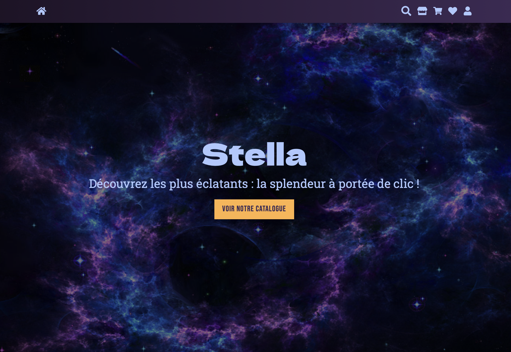
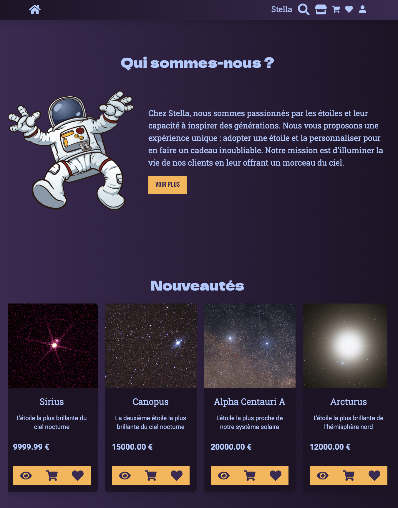
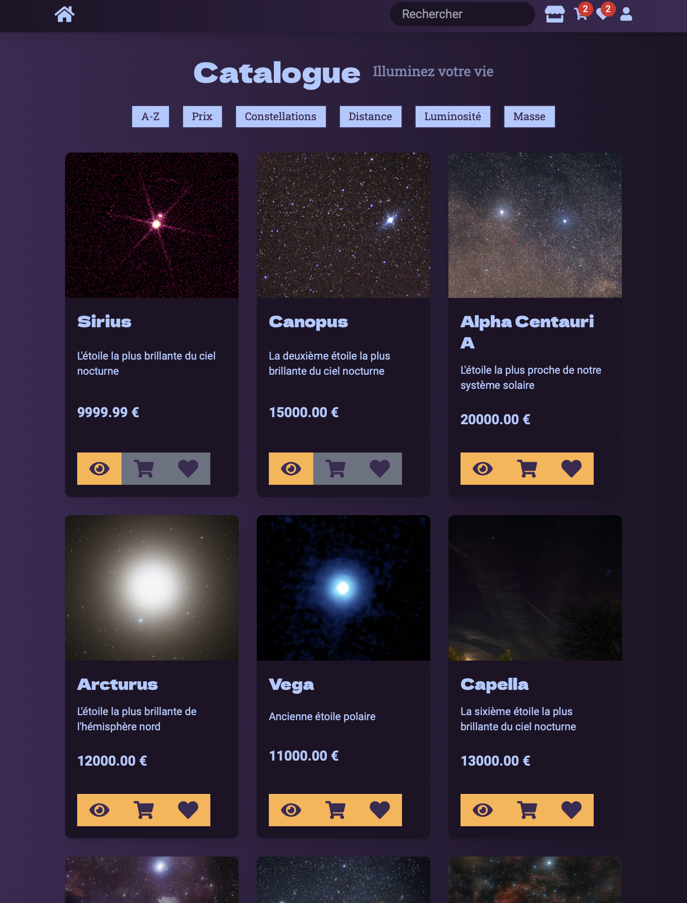
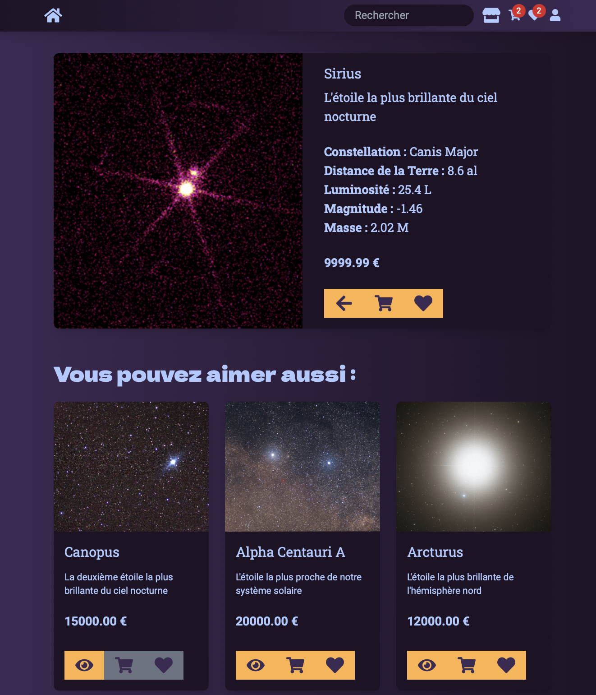
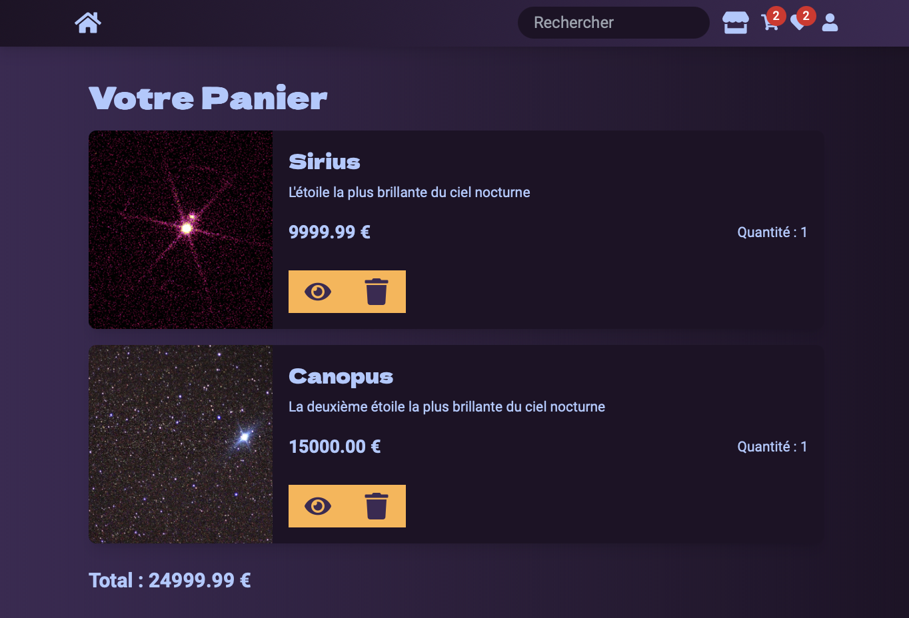
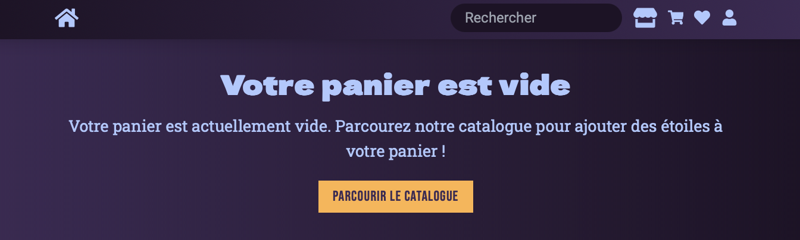
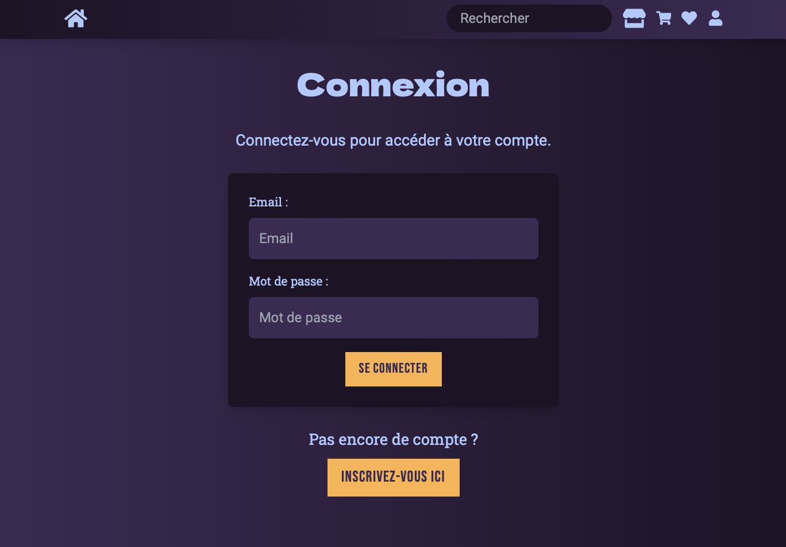
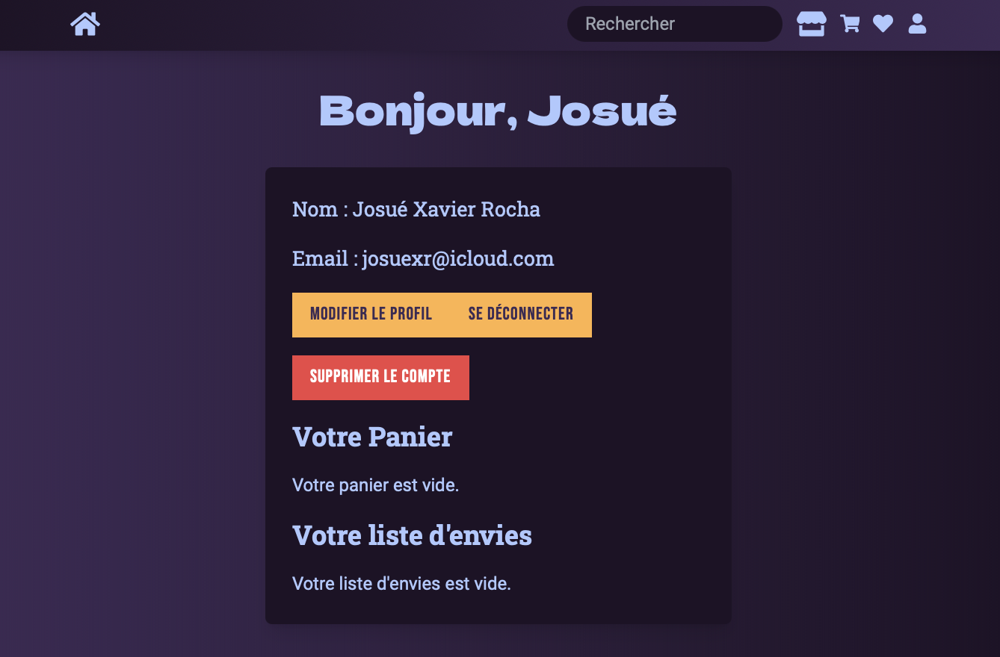

# Stella - Star E-commerce 🌟

Stella is a modern e-commerce application that allows you to buy stars. This project was developed to demonstrate my full stack web development skills, using the latest technologies and industry best practices.

## Features

- Interactive star catalog with filters and search
- Secure user authentication (JWT)
- Dynamic shopping cart and wishlist
- RESTful API developed with Express
- Responsive user interface with React and TypeScript
- Optimized relational database with PostgreSQL and Sequelize
- Automatic linting and formatting with Biome
- Modern design with Tailwind CSS

## Project Overview

### Image Gallery

Here are some screenshots of the application:



*Homepage*



*Homepage sections*



*Star catalog*



*Star detail*



*Shopping cart*



*Empty shopping cart*



*Login page*



*Profile*

## Technologies Used

### Frontend

- React with TypeScript for a robust and typed interface
- Tailwind CSS for modern and responsive design
- React Router for client-side navigation
- Axios for HTTP requests

### Backend

- Node.js with Express for a performant RESTful API
- Sequelize as ORM to interact with PostgreSQL
- JSON Web Tokens (JWT) for authentication and security
- Jest for unit and integration testing

### Database

- PostgreSQL for efficient relational data management
- MoCoDo for conceptual data modeling

### Tools and Practices

- Biome for code linting and formatting
- Git and GitHub for version control and collaboration
- Canva and Excalidraw for visual design
- MVC methodology for clear and maintainable architecture

## Architecture

The project is structured according to an MVC (Model-View-Controller) architecture to separate concerns and improve maintainability.

```
stella-ecommerce/
├── client/          # Frontend React
│   └── src/
│       ├── components/
│       ├── pages/
│       ├── services/
│       ├── styles/
│       └── utils/
├── server/          # Backend Node.js
│   ├── controllers/
│   ├── models/
│   ├── routes/
│   ├── middlewares/
│   └── utils/
├── scripts/         # Global scripts
└── docs/            # Documentation

```

## Installation

### Prerequisites

- Node.js (version 14 or higher)
- npm or yarn
- PostgreSQL (for the database)

### Steps

1. **Clone the repository**
   ```bash
   git clone [your-repo-url]
   cd stella-ecommerce
   ```

2. **Install dependencies**
   ```bash
   # Install server dependencies
   cd server
   npm install
   
   # Install client dependencies
   cd ../client
   npm install
   ```

3. **Configure environment variables**
   - Copy the .env.example files in the client/src/ and server/ folders
   - Rename them to .env
   - Fill in the necessary variables:
     - In client/src/.env, modify the API URL if necessary
     - In server/.env, configure the database and JWT key

4. **Setup PostgreSQL database**
   ```bash
   # Start PostgreSQL service
   brew services start postgresql@15
   
   # Create database and user (if needed)
   createdb stella_ecommerce
   ```

## Usage

### Starting the Application

1. **Start PostgreSQL** (if not already running)
   ```bash
   brew services start postgresql@15
   ```

2. **Start the backend server**
   ```bash
   cd server
   npm run dev
   ```
   Server will run on http://localhost:3000

3. **Start the frontend** (in a new terminal)
   ```bash
   cd client
   npm start
   ```
   Frontend will run on http://localhost:3001

4. **Open your browser**
   Navigate to **http://localhost:3001** to view the application

### Test Accounts

- **Admin**: `admin@stellaecommerce.com` / `adminpassword`
- **Test User**: `test@test.com` / `test123`

### Development Commands

- **Run server tests**: `cd server && npm test`
- **Run client tests**: `cd client && npm test`
- **Lint code**: `npm run lint` (in server or client folder)

## Useful Scripts

- Create tables: `npm run create-tables`
- Generate test data: `npm run generate-data`
- Reset the database: `npm run reset-db`

## Contributing

Contributions are welcome! To contribute to the project, here are the steps:

1. **Fork** the repository
2. Create a **branch** for the feature (`git checkout -b feature/AmazingFeature`)
3. **Commit** the changes (`git commit -m 'Add an amazing feature'`)
4. **Push** to the branch (`git push origin feature/AmazingFeature`)
5. **Pull Request**

### Issues
If there are any issues or improvement ideas, go to issues on the repository. I appreciate all feedback and suggestions.

## Roadmap

## License

[License information coming soon]