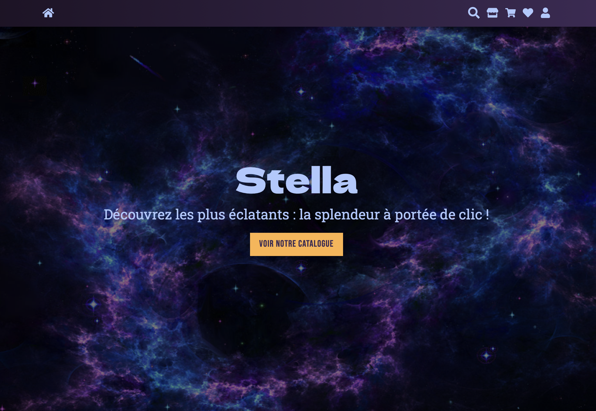
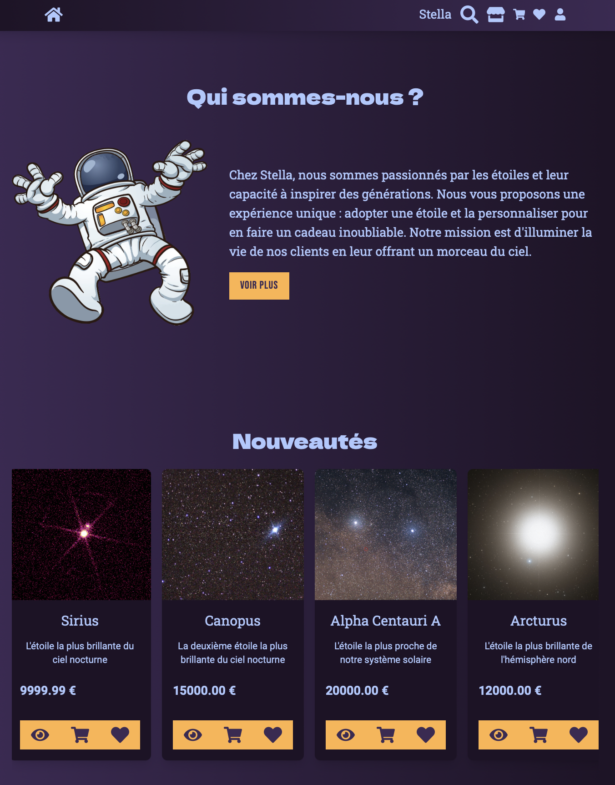
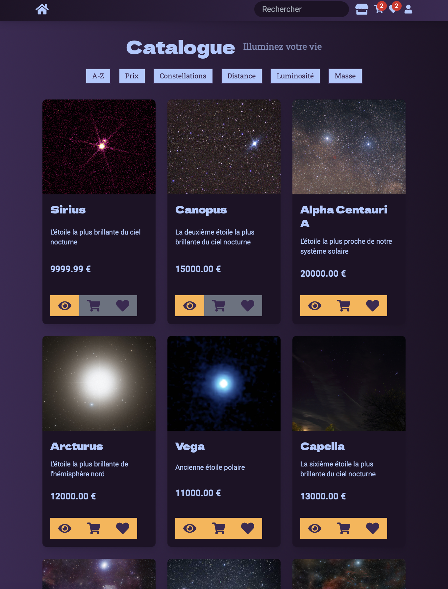
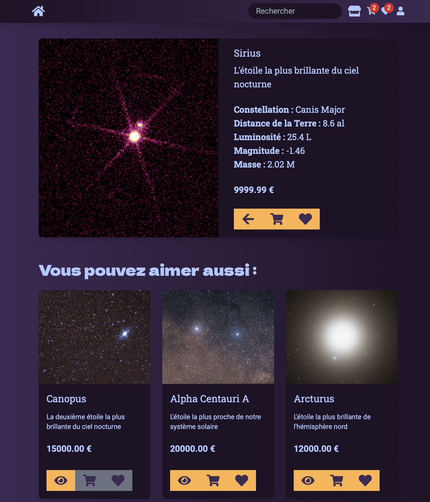
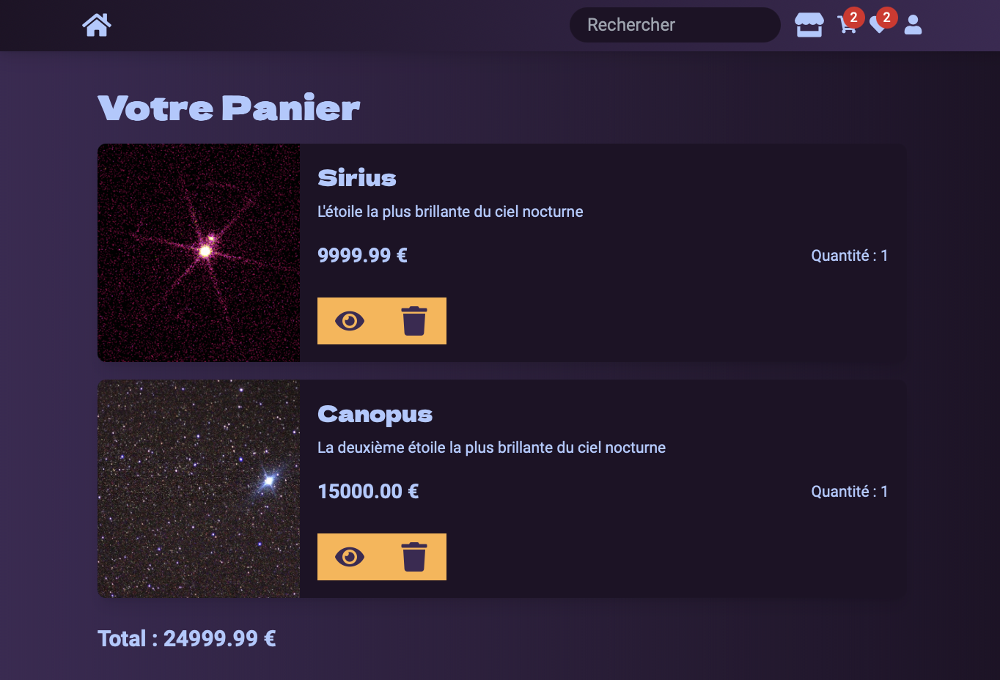
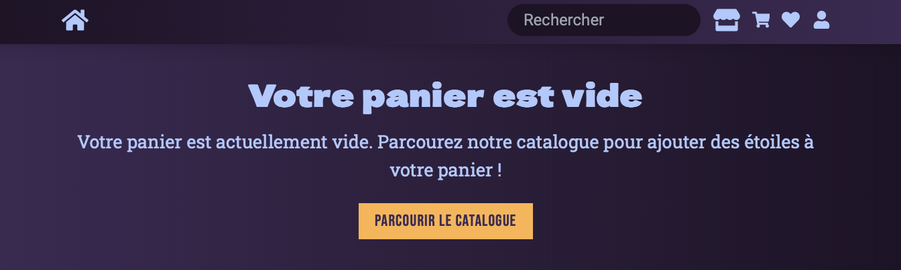
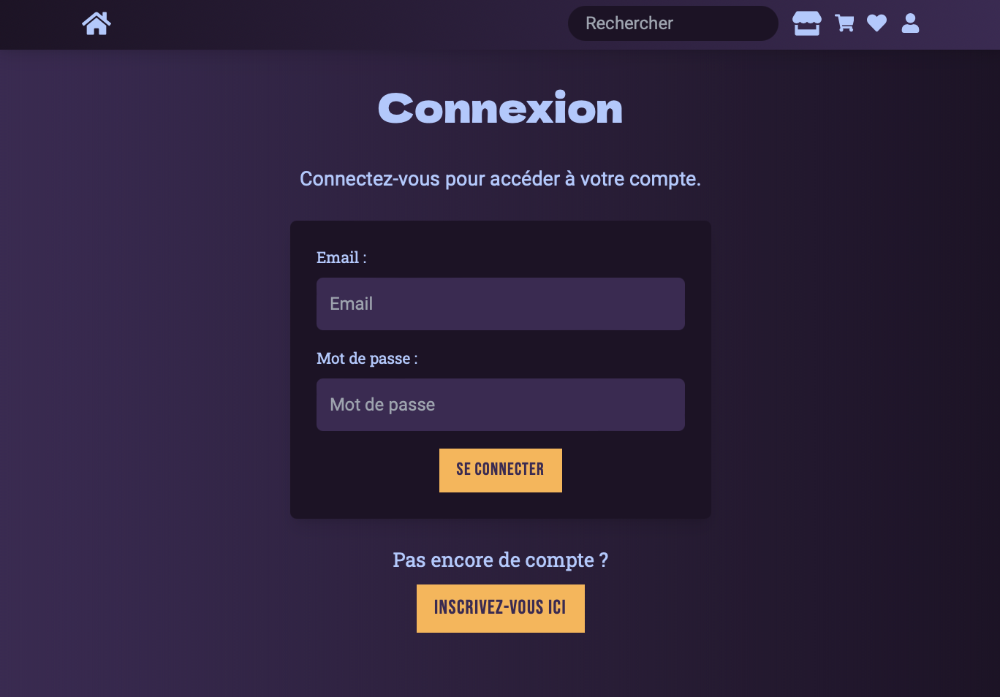
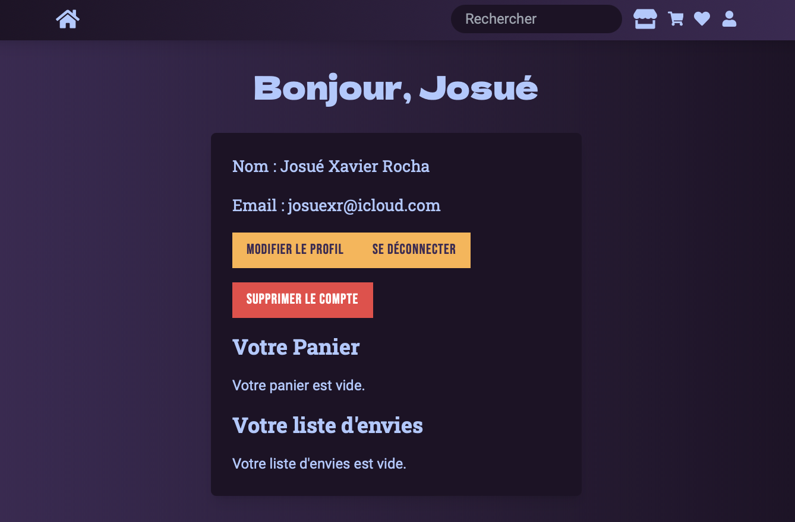

# Stella - Star E-commerce 🌟

Stella is a modern e-commerce application that allows you to buy stars. This project was developed to demonstrate my full stack web development skills, using the latest technologies and industry best practices.

## Features

- Interactive star catalog with filters and search
- Secure user authentication (JWT + CSRF)
- Dynamic shopping cart and wishlist
- Complete checkout flow with order tracking
- User reviews and ratings system
- Admin dashboard with statistics
- RESTful API with Swagger documentation
- Responsive user interface with React and TypeScript
- Optimized relational database with PostgreSQL and Sequelize
- Automatic linting and formatting with Biome
- Docker support for containerized development

## Project Overview

### Image Gallery

Here are some screenshots of the application:



*Homepage*



*Homepage sections*



*Star catalog*



*Star detail*



*Shopping cart*



*Empty shopping cart*



*Login page*



*Profile*

## Technologies Used

### Frontend

- React with TypeScript for a robust and typed interface
- Zustand for global state management
- Tailwind CSS for modern and responsive design
- React Router v7 for client-side navigation
- Axios for HTTP requests

### Backend

- Node.js with Express for a performant RESTful API
- Sequelize as ORM to interact with PostgreSQL
- JSON Web Tokens (JWT) for authentication and security
- Swagger/OpenAPI for API documentation
- Winston for structured logging
- Jest for unit and integration testing

### Database

- PostgreSQL for efficient relational data management

### Tools and Practices

- Biome for code linting and formatting
- Husky + lint-staged for pre-commit hooks
- Docker + docker-compose for containerized development
- GitHub Actions for CI (lint, test, typecheck)
- Git with conventional commits for version control

## Architecture

The project follows an MVC (Model-View-Controller) architecture with dependency injection on the backend and a repository pattern on the frontend.

```
stella-ecommerce/
├── client/                # React TypeScript frontend (port 3001)
│   └── src/
│       ├── components/    # Reusable UI components
│       ├── pages/         # Route-based page components
│       ├── services/      # API calls and external services
│       ├── stores/        # Zustand state management
│       ├── hooks/         # Custom React hooks
│       ├── repositories/  # Data access layer (API abstraction)
│       ├── types/         # TypeScript type definitions
│       ├── utils/         # Helper utilities
│       └── tests/         # Jest test files
├── server/                # Node.js/Express backend API (port 3000)
│   └── src/
│       ├── controllers/   # Route handlers
│       ├── services/      # Business logic
│       ├── models/        # Sequelize ORM models
│       ├── repositories/  # Data access layer
│       ├── routes/        # Express route definitions
│       ├── middlewares/   # Custom middleware functions
│       ├── validations/   # Joi validation schemas
│       ├── container/     # Dependency injection container
│       ├── config/        # Configuration files
│       └── utils/         # Helper utilities
├── scripts/               # Database utility scripts
├── docs/                  # Project documentation
├── .github/workflows/     # CI pipeline
├── docker-compose.yml     # Docker orchestration
└── render.yaml            # Render deployment config
```

## Installation

### Prerequisites

- Node.js >= 18 (recommended: 22, see `.nvmrc`)
- npm
- PostgreSQL

### Option A: Standard Setup

1. **Clone the repository**
   ```bash
   git clone https://github.com/josuerochadev/stella-ecommerce.git
   cd stella-ecommerce
   ```

2. **Install dependencies**
   ```bash
   # Install server dependencies
   cd server
   npm install

   # Install client dependencies
   cd ../client
   npm install
   ```

3. **Configure environment variables**
   ```bash
   # Server
   cp server/.env.example server/.env
   # Edit server/.env with your database credentials and JWT secret

   # Client
   cp client/src/.env.example client/.env
   # Edit client/.env if your API runs on a different URL
   ```

4. **Setup PostgreSQL database**
   ```bash
   # Start PostgreSQL service
   brew services start postgresql@15   # macOS
   # sudo systemctl start postgresql   # Linux

   # Create database
   createdb stella_ecommerce

   # Initialize tables and seed data
   cd server
   npm run create-tables
   npm run generate-data
   ```

### Option B: Docker Setup

```bash
# Start all services (client + server + postgres)
docker-compose up --build

# In a separate terminal, initialize the database
docker-compose exec server node ../scripts/createTables.js
docker-compose exec server node ../scripts/sampleData.js
```

The application will be available at:
- Frontend: http://localhost:3001
- Backend API: http://localhost:3000/api
- Swagger docs: http://localhost:3000/api-docs

## Usage

### Starting the Application (without Docker)

1. **Start the backend server**
   ```bash
   cd server
   npm run dev
   ```
   Server will run on http://localhost:3000

2. **Start the frontend** (in a new terminal)
   ```bash
   cd client
   npm start
   ```
   Frontend will run on http://localhost:3001

3. **Open your browser**
   Navigate to **http://localhost:3001** to view the application

### Demo Accounts

The seed data creates test accounts. Credentials are available in the application's seed script (`scripts/sampleData.js`).

### Development Commands

| Command | Location | Description |
|---------|----------|-------------|
| `npm run dev` | server/ | Start dev server with hot reload |
| `npm start` | client/ | Start React dev server |
| `npm test` | both | Run tests |
| `npm run lint` | both | Run Biome linter |
| `npm run format` | both | Format code with Biome |
| `npm run create-tables` | server/ | Initialize database tables |
| `npm run generate-data` | server/ | Populate with sample data |
| `npm run reset-db` | server/ | Reset database completely |

## API Documentation

The API is documented with Swagger/OpenAPI. Once the server is running, visit:

**http://localhost:3000/api-docs**

All endpoints are organized by tags: Stars, Authentication, Cart, Orders, Reviews, Wishlist, Payments, Admin, Profile.

## Contributing

Contributions are welcome! Please read our guidelines before submitting a PR:

1. **Fork** the repository
2. Create a **branch** for the feature (`git checkout -b feature/AmazingFeature`)
3. **Commit** using [conventional commits](https://www.conventionalcommits.org/) (`feat:`, `fix:`, `refactor:`, etc.)
4. **Push** to the branch (`git push origin feature/AmazingFeature`)
5. Open a **Pull Request** (1 PR = 1 topic, no catch-all PRs)

Pre-commit hooks (Husky + Biome) run automatically. Do not bypass with `--no-verify`.

### Issues

If there are any issues or improvement ideas, go to issues on the repository. I appreciate all feedback and suggestions.

## Roadmap

See [docs/ROADMAP.md](./docs/ROADMAP.md) for the detailed project roadmap.

## License

This project is licensed under the MIT License — see the [LICENSE](./LICENSE) file for details.
